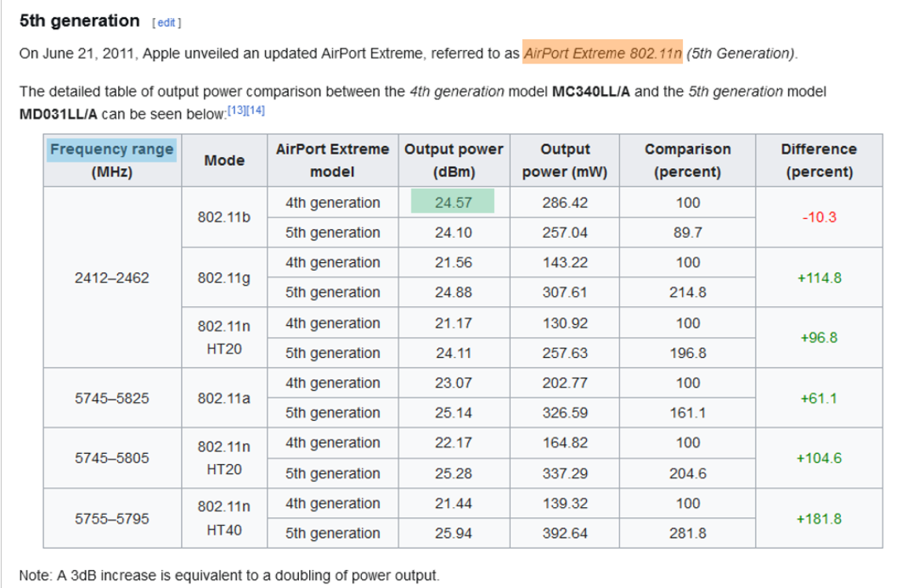

TRIPLET 2026: International Workshop on Extraction from Triplet Text-Table-Knowledge Graph and associated Challenge @ [23rd European Semantic Web Conference (ESWC 2026)](https://2026.eswc-conferences.org/), Dubrovnik, Croatia

## Motivation
Understanding information spread across text and table is essential for tasks such as question answering and fact checking. Existing benchmarks primarily deal with semantic table interpretation or reasoning over tables for question answering, leaving a gap in evaluating models that integrate tabular and textual information, perform joint information extraction across modalities, or can automatically detect inconsistencies between modalities.

This workshop aims to provide a forum for exchanging ideas between the NLP community working on open information extraction and the vibrant Semantic Web community working on the core challenge of matching tabular data to Knowledge Graphs, on populating knowledge graphs using texts and on reasoning across text, tabular data and knowledge graphs. The workshop also targets researchers focusing on the intersection of learning over structured data and information retrieval, for example, in retrieval augmented generation (RAG) and question answering (QA) systems. Hence, the goal of the workshop is to connect researchers and trigger collaboration opportunities by bringing together views from the Semantic Web, NLP, database, and IR disciplines.

## Important Dates

+ **Submission deadline**: 3 March, 2026 (11:59pm, AoE)
+ **Notifications**: 31 March, 2026
+ **Camera-ready deadline**: 15 April, 2026 (11:59pm, AoE)
+ **Workshop**: Sunday 10 May OR Monday 11 May 2026

## Scope

The topics of interest include but are not limited to:
+ Semantic Table Interpretation
+ Automated Tabular Data Understanding
+ Using Large Language Models (LLMs) for Information Extraction
+ Generative Models and LLMs for Structured Data 
+ Knowledge Graph Construction and Completion with Tabular Data and Texts
+ Analysis of Tabular Data on the Web (Web Tables)
+ Benchmarking and Evaluation Frameworks for Joint Text-Table Data Analysis
+ Applications (e.g. data search, fact-checking, Question-Answering, KG alignment)

## Submission Guidelines

We invite two types of submissions:

1. Full research papers (12-15 pages) including references and appendices
1. Challenge papers (6-8 pages) including references and appendices 

All submissions should be formatted in the [CEUR layout format](https://www.overleaf.com/latex/templates/template-for-submissions-to-ceur-workshop-proceedings-ceur-ws-dot-org/wqyfdgftmcfw).

This workshop is double-blind and non-archival. Submissions are managed through EasyChair at [https://easychair.org/conferences/?conf=triplet2026](https://easychair.org/conferences/?conf=triplet2026). All accepted papers will be presented as posters or as oral talks.

## TRIPLET Challenge

In recent years, the research community has shown increasing interest in the joint understanding of text and tabular data, often, for performing tasks such as question answering or fact checking where evidences can be found in texts and tables. Hence, various benchmarks have been developed for jointly querying tabular data and textual documents in domains such as finance, scientific publications, and open domain. While benchmarks for triple extraction from text for Knowledge Graph construction and semantic annotation of tabular data exist in the community, there remains a gap in benchmarks and tasks that specifically address the joint extraction of triples from text and tables by leveraging complementary clues across these different modalities.

The TRIPLET 2026 challenge is proposing three sub-tasks and benchmarks for understanding the complementarity between tables, texts, and knowledge graphs, and in particular to propose a joint knowledge extraction and reconciliation process.

### Sub-Task 1: Assessing the Relatedness Between Tables and Textual Passages

The goal of this task is to assess the relatedness between tables and textual passages (within documents and across documents). For this purpose, we have constructed LATTE (Linking Across Table and Text for Relatedness Evaluation), a human annotated dataset comprising table–text pairs with relatedness labels. LATTE consists of 7,674 unique tables and 41,880 unique textual paragraphs originating from 3,826 distinct Wikipedia pages. Each text paragraph is drawn from the same or contextually linked pages as the corresponding table, rather than being artificially generated. LATTE provides a challenging benchmark for cross-modal reasoning by requiring classification of related and unrelated table–text pairs. Unlike prior resources centered on table-to-text generation or text retrieval, LATTE emphasizes fine-grained semantic relatedness between structured and unstructured data.

The Figure below provides an example, using a web-annotation tool we developed, of how we identify the relatedness between the sentence containing the entity AirPort Extreme 802.11n and the data table providing information about output power and frequency for this entity. Participants are provided with tables and textual passages that would need to be ranked. The evaluation uses metrics such as P@k, R@k and F1@k.

Go to [https://www.codabench.org/competitions/12776/](https://www.codabench.org/competitions/12776/) and enroll to participate in this Task.

### Sub-Task 2: Joint Relation Extraction Between Texts and Tables

The goal of this task is to automatically extract knowledge jointly from tables and related texts. For this purpose, we created ReTaT, a dataset that can be used to train and evaluate systems for extracting such relations. This dataset is composed of (table, surrounding text) pairs extracted from Wikipedia pages and has been manually annotated with relation triples. ReTaT is organized in three subsets with distinct characteristics: domain (business, telecommunication and female celebrities), size (from 50 to 255 pairs), language (English vs French), type of relations (data vs object properties), close vs open list of relation, size of the surrounding text (paragraph vs full page). We then assessed its quality and suitability for the joint table-text relation extraction task using Large Language Models (LLMs).

Given a Wikipedia page containing texts and tables and a list of predicates defined in Wikidata, a participant system should extract triples composed of mentions located partly in the text and partly in the table and disambiguated with entities and predicates identified in the Wikidata reference knowledge graph. For example, in the Figure below, an annotation triple `<Q13567390, P2109, 24.57>` is associated with mentions highlighted in yellow (subject), blue (predicate) and green (object) to annotate the document available at [https://en.wikipedia.org/wiki/AirPort_Extreme](https://en.wikipedia.org/wiki/AirPort_Extreme). Similar to the [Text2KGBench evaluation](https://link.springer.com/chapter/10.1007/978-3-031-47243-5_14), and because the set of triples are not exhaustive for a given sentence, to avoid false negatives, we follow a locally closed approach by only considering the relations that are part of the ground truth. The evaluation then uses metrics such as P, R and F1.

Go to [https://www.codabench.org/competitions/12936/](https://www.codabench.org/competitions/12936/) and enroll to participate in this Task.

### Sub-Task 3: Detecting Inconsistencies Between Texts, Tables and Knowledge Graphs

The goal of this task is to check the consistency of knowledge extracted from tables and texts with existing triples in the Wikidata knowledge graph. Different kind of inconsistencies will be considered in this task. Participants to this task will be able to report on their findings in their system paper.

### Data & Evaluation
For the first 2 sub-tasks, we have released a training dataset with ground-truth annotations, enabling participant teams to develop machine learning-based systems, and in particular for training purposes and for hyperparameter optimizations and internal validations. 

A separate blind test dataset will remain private and be used for ranking the submissions.

Participants should [register on Codabench](https://www.codabench.org/) and then enroll for each sub-task separately ([Task 1](https://www.codabench.org/competitions/12776/) and [Task 2](https://www.codabench.org/competitions/12936/)). Each team are allowed a limited number of daily submissions, and the highest achieved accuracy will be reported as the team's final result. We encourage participants to develop open-source solutions, to utilise and fine-tune pre-trained language models and to experiment with LLMs of various size in zero-shot or few-shot settings.

### Challenge Important Dates

| Event                                 | Date          |
| ------------------------------------- | -------------- |
| Release of training set               | 13 February 2026 |
| Deadline for registering to the challenge |15 March 2026 |
| Release of test set                   | 24 March 2026 |
| Submission of results                 | 10 April 2026 |
| System Results & Notification of Acceptance | 17 April 2026 |
| Submission of System Papers           | 28 April 2026 |
| Presentations @ TRIPLET Workshop      | May 2026 |

## Workshop Organizers
- [Raphael Troncy](https://www.eurecom.fr/fr/people/troncy-raphael) (EURECOM, France)
- [Yoan Chabot](https://yoanchabot.github.io/) (Orange, France)
- [Véronique Moriceau](https://www.irit.fr/~Veronique.Moriceau/) (IRIT, France)
- [Nathalie Aussenac-Gilles](https://www.irit.fr/~Nathalie.Aussenac-Gilles/) (IRIT, France)
- [Mouna Kamel](https://www.irit.fr/~Mouna.Kamel/) (IRIT, France)
    
Contact: 
For discussions, please use our [Google Group](https://groups.google.com/g/triplet-challenge)

The workshop is supported by the ECLADATTA project funded by the French National Funding Agency ANR under the grant ANR-22-CE23-0020.